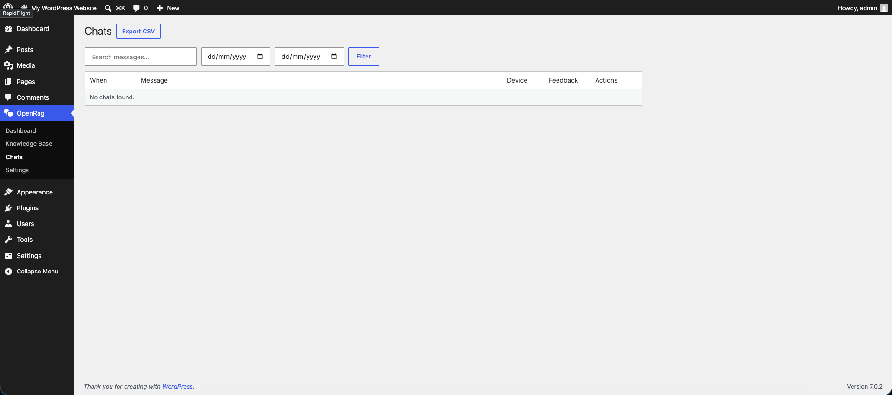
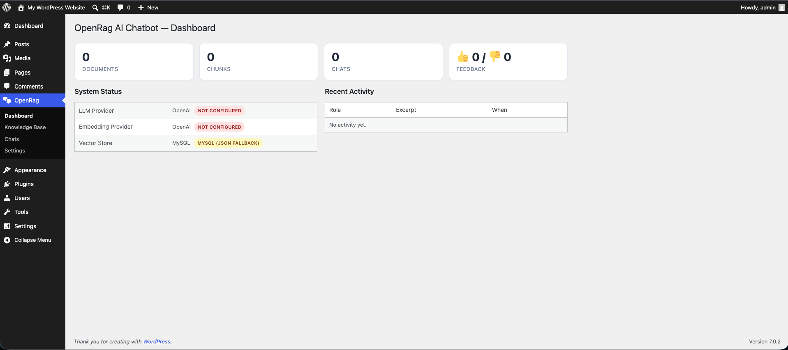
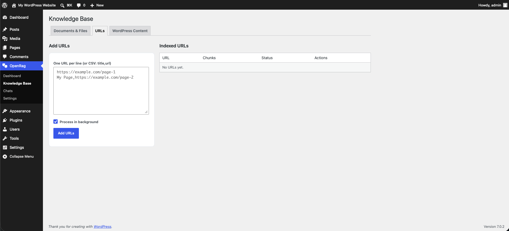
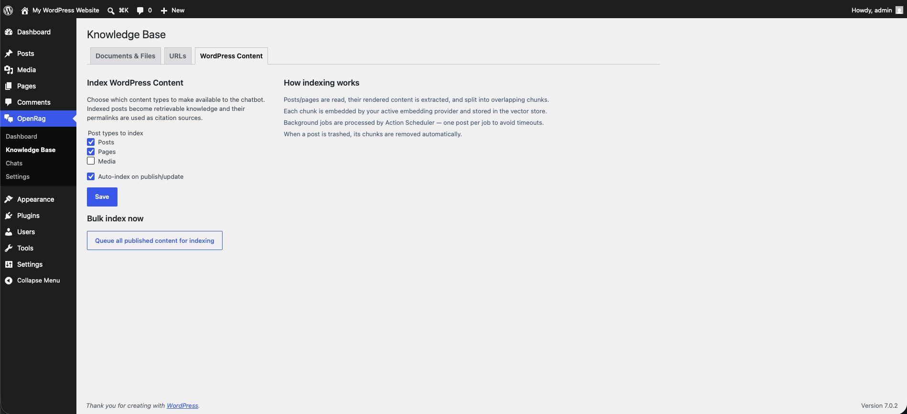
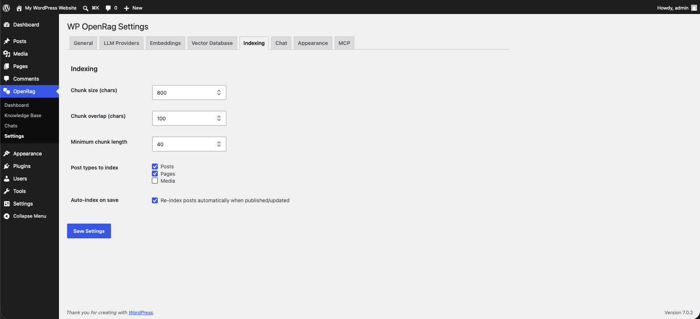
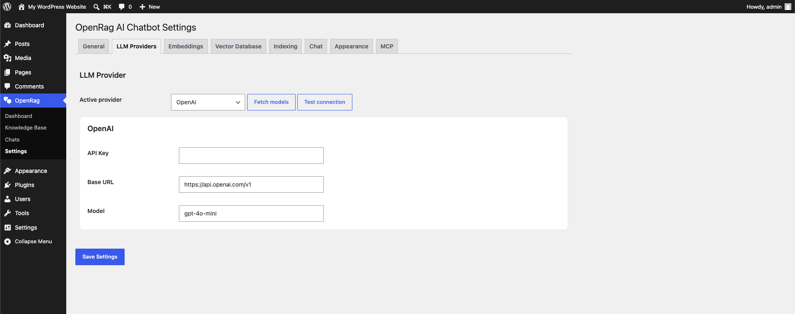
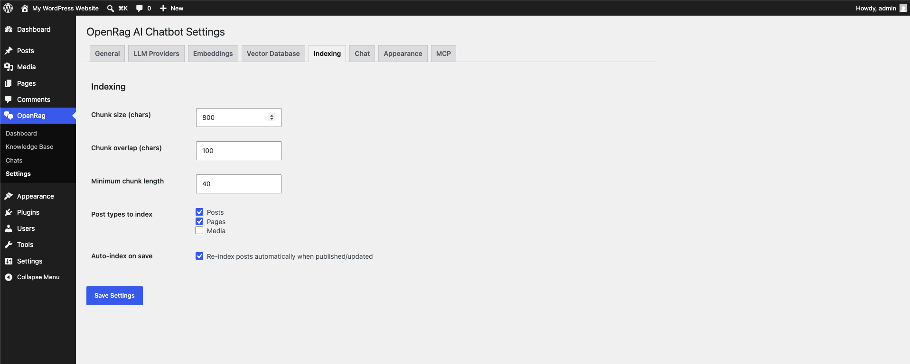
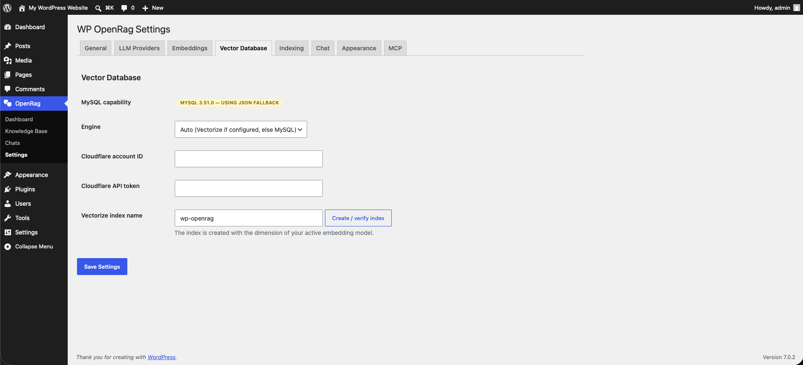
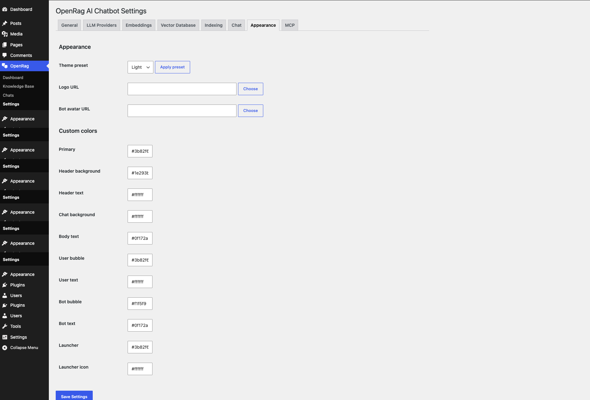
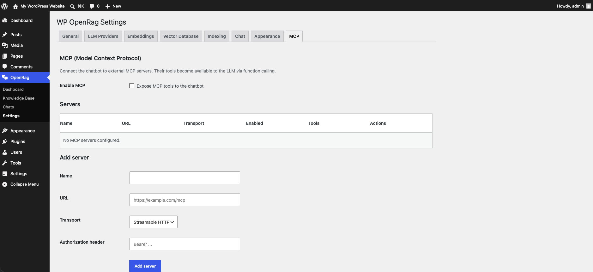

# OpenRag AI Chatbot

> A complete, self-hosted **RAG (Retrieval-Augmented Generation) chatbot** for WordPress.
> Ingest your own documents, links and posts, embed them with the provider of your choice,
> retrieve with native MySQL 9 vector search or Cloudflare Vectorize, and answer visitor
> questions with **citations, reasoning, live streaming and MCP tool integration** — all from
> a customizable, conflict-free chat widget.

[](./CHANGELOG.md)
[](./LICENSE)
[](https://www.php.net/)
[](https://wordpress.org/)
[-4479a1.svg)](https://www.mysql.com/)

---

## ✨ Features

### 📚 Knowledge base ingestion
- **Import URLs** — paste one or many (one per line, or `title,url` CSV). Pages are fetched,
  boilerplate is stripped (`<nav>`, `<footer>`, `<script>` …), the readable text is extracted,
  then chunked, embedded and indexed.
- **Import files** — **PDF** (via [`smalot/pdfparser`](https://github.com/smalot/pdfparser)),
  **DOCX** (native `ZipArchive` + `word/document.xml` parser), **TXT**, **Markdown**.
  Upload through the WordPress media library or paste a URL.
- **Index your own WordPress content** — pick which post types (posts, pages, custom) become
  searchable. Auto re-indexes on `save_post`, removes on `wp_trash_post`. The permalink is
  stored as the citation source.

### 🧠 Embeddings & vector search
- Configurable **chunk size, overlap, and minimum length** (sentence-aware splitter that
  preserves formatting — no more `sanitize_text_field` mangling).
- Embedding providers: **OpenAI**, **OpenAI-compatible** (Together / Azure / vLLM / LM Studio),
  **Cloudflare Workers AI** (`bge-*`, `bge-m3`), **Ollama** (local, `nomic-embed-text`).
- Vector stores:
  - **MySQL** — uses native `VECTOR(n)` columns + `DISTANCE(..., 'COSINE')` when **MySQL ≥ 9**
    is detected; transparently falls back to JSON storage + PHP cosine similarity otherwise.
  - **Cloudflare Vectorize** — full REST v2 client (`insert`, `query`, `delete-by-ids`,
    `create-index`). A "Create index" button auto-detects the dimension from your embedding model.

### 💬 Chatbot
- **SSE streaming** (fetch + `ReadableStream`) for live, token-by-token answers, with a
  non-streaming `/chat/sync` fallback.
- **Citations** — built from retrieval metadata and appended as a *Sources* list. Per-answer
  toggle in **Chat** settings.
- **Reasoning / extended thinking** — per provider (`reasoning_effort` on OpenAI,
  `thinking.budget_tokens` on Anthropic, `<think>` blocks on DeepSeek/Ollama models).
  Shown in a collapsible UI section.
- **Tool calling** — when an LLM emits tool calls the chatbot executes them in a bounded loop.
- **Rate limiting** — per-IP request throttling via transients.
- **Conversation history** — server-side + `localStorage` session continuity.

### 🤖 LLM providers
OpenAI · OpenAI-compatible · **Anthropic Claude** · **Cloudflare Workers AI** · **Groq** ·
**Ollama** (local). Per-provider API key, base URL, model. "Fetch models" and
"Test connection" buttons in the admin.

### 🔌 MCP integration (Model Context Protocol — client mode)
- Connect to **external MCP servers** (streamable HTTP or SSE transport) from the MCP tab.
- **Discover & cache** each server's tool list.
- Discovered tools are offered to the LLM via **function calling**; the chatbot runs a
  bounded tool-call loop (max 5 iterations), invoking `tools/call` on the MCP server and
  feeding results back into the conversation.
- Tool invocations surface as a `🔧 Using tool: X` badge in the chat stream.

### 🎨 Frontend widget
- **Conflict-proof** — every element is scoped inside `#openrag-widget`, every class is
  prefixed `openrag-`, all theming happens through `--openrag-*` custom properties on the root.
  No leaked styles, no global selectors.
- Two delivery modes: **floating widget** (auto-injected, toggleable) and
  **`[openrag_chat]` shortcode** for inline embedding.
- **4 preset themes** — Light, Dark, Ocean, Sunset — plus per-color overrides.
- **Logo, bot avatar, bot name, welcome message, launcher position** — all configurable.
- Vanilla JS, mobile-responsive, markdown rendering with HTML escaping (no XSS).

### 🛠 Admin UI
- **Dashboard** — totals (documents, chunks, chats, 👍/👎), system status (active provider +
  vector store mode), recent activity.
- **Knowledge Base** — Documents/Files, URLs, WordPress Content tabs. Add forms, status
  badges, per-item reindex/delete, chunk-preview modal, bulk CSV URL import.
- **Chats** — paginated list of every conversation with search, date filter, feedback icons,
  a detail modal (message, reply, reasoning, citations) and **CSV export**.
- **Settings** — tabbed: General · LLM Providers · Embeddings · Vector Database · Indexing ·
  Chat · Appearance · MCP. Nonces + sanitization throughout.

### ⚙️ Background processing
- **Action Scheduler** (the library WooCommerce ships) — one job per document/post, retry
  and exponential backoff handled automatically.
- **On-request mode** alternative — process immediately via AJAX, ideal for small imports.

---

## 📦 Installation

### From a release ZIP (recommended for most users)

1. Download the latest `openrag-ai-chatbot-{version}.zip` from the
   [**Releases** page](https://github.com/mahavirvataliya/openrag-ai-chatbot/releases).
   *(Release ZIPs ship with `vendor/` pre-built — no Composer required.)*
2. In WordPress: **Plugins → Add New → Upload Plugin → Choose File** → select the ZIP →
   **Install Now**.
3. Activate **OpenRag AI Chatbot**.
4. Go to **OpenRag → Settings** and configure at least one LLM provider and one embedding
   provider.

### From source (for developers)

```bash
git clone https://github.com/mahavirvataliya/openrag-ai-chatbot.git openrag-ai-chatbot
cd openrag-ai-chatbot
composer install --no-dev
```

Then copy/symlink the `openrag-ai-chatbot` folder into `wp-content/plugins/` and activate it.

### Requirements

| Requirement | Minimum | Notes |
|-------------|---------|-------|
| PHP | **8.0** | 8.1+ recommended |
| WordPress | **6.0** | |
| MySQL | **5.7** | MySQL **9.0+** unlocks native `VECTOR` storage & search; otherwise a JSON+PHP fallback is used |
| Embedding provider | one of | OpenAI · OpenAI-compatible · Cloudflare Workers AI · Ollama |
| LLM provider | one of | OpenAI · OpenAI-compatible · Anthropic · Cloudflare Workers AI · Groq · Ollama |

---

## 🚀 Quick start

1. **OpenRag → Settings → LLM Providers** — pick a provider, paste your key, choose a model.
   Click **Test connection** to verify.
2. **OpenRag → Settings → Embeddings** — do the same for embeddings.
   (Cloudflare's free-tier Workers AI works for both.)
3. **OpenRag → Settings → Vector Database** — review the detected capability and pick an
   engine (or leave on **Auto**). If using Cloudflare Vectorize, click **Create / verify index**.
4. **OpenRag → Knowledge Base** — add a URL or upload a PDF, or use the
   **WordPress Content** tab to index your existing posts/pages.
5. **OpenRag → Settings → Chat** — confirm the bot name, welcome message and launcher position.
6. Visit your site — the chat bubble appears in the corner.

Embed your chatbot inline anywhere with the shortcode:

```text
[openrag_chat]
```

---

## 🔌 REST API

Namespace: `openrag/v1` — base URL: `/wp-json/openrag/v1`.

| Method | Path | Auth | Purpose |
|--------|------|------|---------|
| `POST`   | `/chat`                   | public (nonce) | SSE-streaming chat |
| `POST`   | `/chat/sync`              | public (nonce) | Non-streaming chat |
| `POST`   | `/feedback`               | public (nonce) | 👍/👎 feedback on a message |
| `GET`    | `/history`                | public (nonce) | Session-scoped history |
| `DELETE` | `/history`                | public (nonce) | Clear session history |
| `GET`    `/ POST` | `/documents`     | admin | List / create documents |
| `GET` / `DELETE` | `/documents/<id>` | admin | Get / delete a document |
| `POST`   | `/documents/<id>/process` | admin | Queue or process immediately |
| `POST`   | `/posts/index`            | admin | Bulk-index WordPress posts |
| `GET` / `POST` | `/mcp/servers`      | admin | List / add MCP servers |
| `POST` / `DELETE` | `/mcp/servers/<id>` | admin | Update / delete a server |
| `POST`   | `/mcp/servers/<id>/discover` | admin | Refresh a server's tool list |
| `GET`    | `/admin/models`           | admin | List active provider's models |
| `POST`   | `/admin/test`             | admin | Test active provider connection |
| `POST`   | `/vector-store/create-index` | admin | Create/verify Vectorize index |

All public endpoints accept the standard WordPress REST nonce via the `X-WP-Nonce` header
(passed automatically by the bundled widget).

---

## 🗄 Database schema

All tables are prefixed with `{$wpdb->prefix}openrag_`:

| Table | Holds |
|-------|-------|
| `documents` | Knowledge-base source records (`pdf`, `url`, `post`, `docx`, `txt`) |
| `chunks` | Chunked content + embedding (`VECTOR(n)` on MySQL 9, JSON `LONGTEXT` otherwise) + citation source |
| `chats` | Every chat turn (user + assistant), citations JSON, reasoning, tool calls, model, tokens, response time, feedback |
| `chat_sessions` | Anonymous session tracking |
| `mcp_servers` | MCP server config + cached tool lists |

Uninstalling is safe by default. Enable **Advanced → Remove data on uninstall** in settings to
drop all tables and options when the plugin is deleted.

---

## 📸 Screenshots

Every screen of the plugin. The same images and captions power the WordPress.org directory
page ([`readme.txt`](./readme.txt) `== Screenshots ==`) and are browsable in
[`.wordpress-org/screenshots/`](./.wordpress-org/screenshots).

### Dashboard

**1. Dashboard** — overview cards (documents, chunks, chats, feedback), system status
showing the active LLM, embedding provider and vector store mode, plus recent activity.



### Knowledge Base

**2. Knowledge Base — Documents & Files** — upload PDF/DOCX/TXT/MD files or paste a URL;
documents are listed with live status badges, chunk counts and reindex/delete actions.



**3. Knowledge Base — WordPress Content** — pick which post types (posts, pages, CPTs)
become searchable, enable auto-indexing, and bulk-queue existing content for embedding.


**4. Knowledge Base — URLs** — paste one or many URLs (plain list or `title,url` CSV) to
fetch, extract readable text, embed and index.



### Chats

**5. Chats** — paginated list of every conversation with search, date filter, feedback
icons (👍/👎), per-row detail view, and one-click CSV export.



### Settings

**6. Settings — General** — enable/disable the plugin and set global options.



**7. Settings — LLM Providers** — choose between OpenAI, OpenAI-compatible, Anthropic,
Cloudflare, Groq, or Ollama. Fetch models and test the connection right from the admin.



**8. Settings — Embeddings** — configure the embedding provider separately from the LLM
(OpenAI, OpenAI-compatible, Cloudflare Workers AI, or local Ollama).


**9. Settings — Vector Database** — auto-detected MySQL 9 native VECTOR capability, engine
selector (Auto / MySQL / Cloudflare Vectorize), and one-click Vectorize index creation.


**10. Settings — Indexing** — chunk size, overlap and minimum chunk length, plus the post
types and auto-index options.



**11. Settings — Chat** — bot name, welcome message, system prompt, citations toggle,
reasoning/extended-thinking toggle, top-K, similarity threshold, and rate limiting.



**12. Settings — Appearance** — four preset themes (Light, Dark, Ocean, Sunset) with
per-color overrides, plus custom logo and bot avatar upload.



**13. Settings — MCP** — connect to external MCP servers (streamable HTTP or SSE),
discover their tools, and enable them for use by the chatbot via function calling.



### Frontend

**14. Frontend chat widget** — floating chat with streaming answers, a collapsible
reasoning panel, citations/sources list, and thumbs-up/down feedback.


---

## 🏗 Architecture

```
openrag-ai-chatbot/
├── openrag-ai-chatbot.php              # Headers, constants, bootstrap
├── uninstall.php               # Opt-in full cleanup
├── composer.json
├── includes/
│   ├── class-plugin.php        # Singleton wiring all hooks
│   ├── class-activator.php     # Schema + default options
│   ├── class-settings.php      # Centralized settings + theme presets
│   ├── class-autoloader.php    # PSR-4 fallback (composer-free installs)
│   ├── Database/               # dbDelta + MySQL 9 VECTOR detection
│   ├── Embeddings/             # OpenAI · compatible · Cloudflare · Ollama + manager
│   ├── LLM/                    # OpenAI/Groq/compatible · Anthropic · Cloudflare · Ollama + manager
│   ├── VectorStores/           # MySQL (native/fallback) · Cloudflare Vectorize + manager
│   ├── Ingestion/              # Chunker · document loaders · pipeline
│   ├── Queue/                  # Action Scheduler integration
│   ├── Chat/                   # RAG engine · SSE controller · rate limiter
│   ├── MCP/                    # JSON-RPC client + manager
│   └── Admin/                  # Menu · dashboard · KB · chats · settings · admin REST
├── templates/chatbot-widget.php
└── assets/{css,js}             # chatbot.{css,js}, admin.{css,js}
```

---

## 🧰 Building a release

A one-file release script is included for maintainers:

```bash
./bin/build-release.sh 1.0.0
# → produces dist/openrag-ai-chatbot-1.0.0.zip with vendor/ included
```

GitHub Actions workflow (`.github/workflows/release.yml`) is provided so tagged pushes
(`git tag v1.0.0 && git push --tags`) automatically produce a release ZIP attached to the
GitHub Release.

---

## 🤝 Contributing

Pull requests are welcome. Please:

1. Fork & branch from `main`.
2. Run `composer install` (dev) and `php -l` on changed files.
3. Keep the **CSS class prefix `openrag-`** and the **`#openrag-widget` root scope** intact —
   this is what keeps the widget conflict-free on arbitrary sites.
4. Open a PR describing the change and referencing any issue.

---

## 📝 Changelog

See [**CHANGELOG.md**](./CHANGELOG.md) for the full history.

---

## 📄 License

**GPL-2.0-or-later** — see [LICENSE](./LICENSE).

Bundled third-party libraries (in `vendor/`):
- [`smalot/pdfparser`](https://github.com/smalot/pdfparser) — LGPL-3.0
- [`woocommerce/action-scheduler`](https://github.com/woocommerce/action-scheduler) — GPL-3.0
- [`symfony/polyfill-mbstring`](https://github.com/symfony/polyfill-mbstring) — MIT

This plugin is not affiliated with or endorsed by WordPress, OpenAI, Anthropic, Cloudflare,
Groq, or Automattic.
