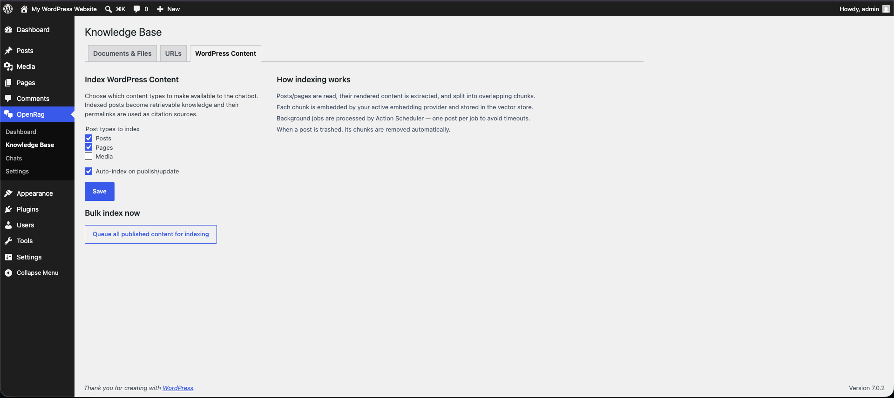
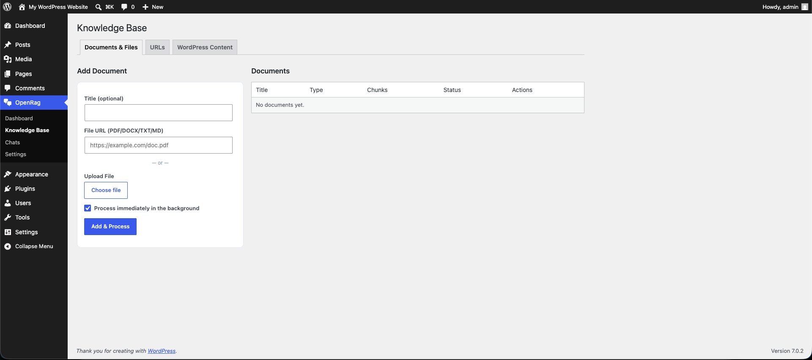
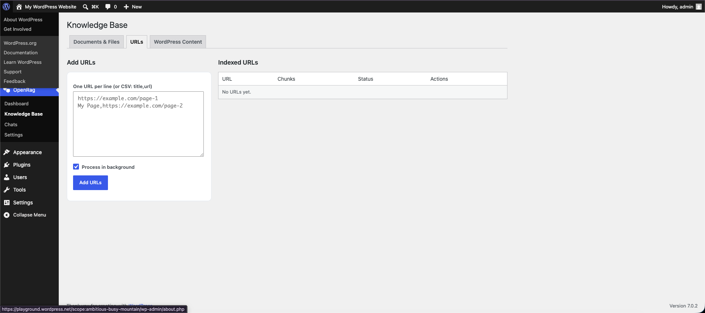
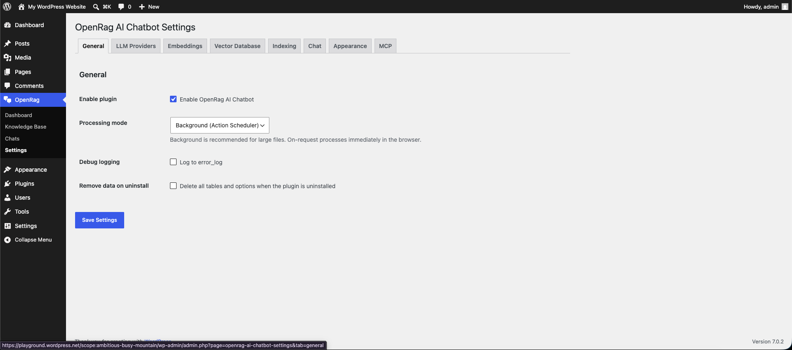
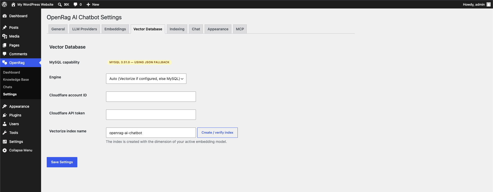
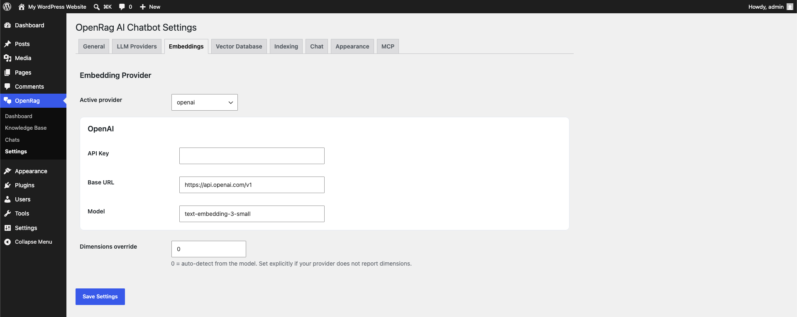
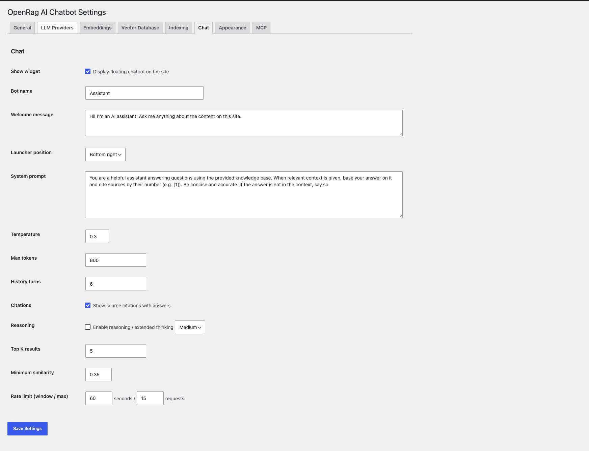
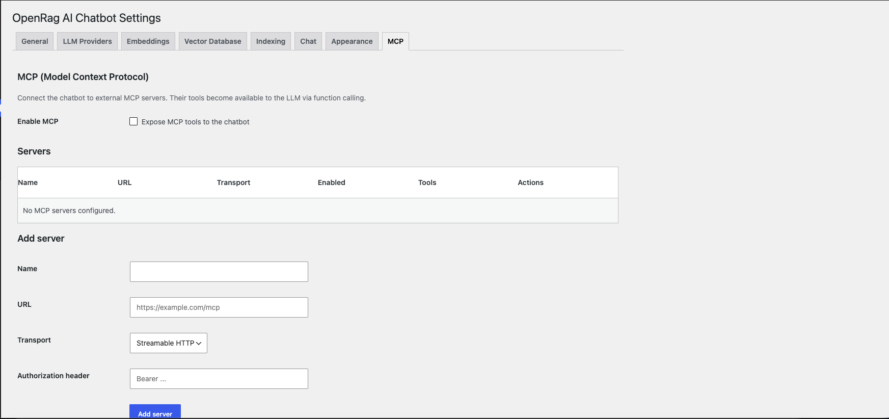
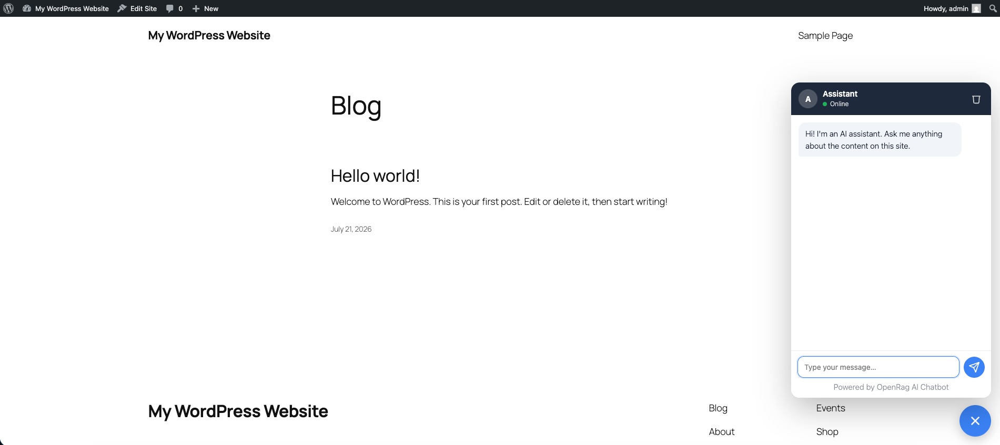

# Screenshots
{: .fs-9 }

{: .fw-300 }
Every screen of the plugin. The same images power the WordPress.org directory
page.

---

## Dashboard

### 1. Dashboard
{: .d-inline }

Overview cards (documents, chunks, chats, feedback), system status showing the
active LLM, embedding provider and vector store mode, plus recent activity.

---

## Knowledge Base

### 2. Knowledge Base — Documents & Files
{: .d-inline }

Upload PDF/DOCX/TXT/MD files or paste a URL; documents are listed with live
status badges, chunk counts and reindex/delete actions.

### 3. Knowledge Base — WordPress Content
{: .d-inline }

Pick which post types (posts, pages, CPTs) become searchable, enable
auto-indexing, and bulk-queue existing content for embedding.

### 4. Knowledge Base — URLs
{: .d-inline }

Paste one or many URLs (plain list or `title,url` CSV) to fetch, extract
readable text, embed and index.

---

## Chats

### 5. Chats
{: .d-inline }

Paginated list of every conversation with search, date filter, feedback icons
(👍/👎), per-row detail view, and one-click CSV export.

---

## Settings

### 6. Settings — General
{: .d-inline }

Enable/disable the plugin and set global options.

### 7. Settings — LLM Providers
{: .d-inline }

Choose between OpenAI, OpenAI-compatible, Anthropic, Cloudflare, Groq, or
Ollama. Fetch models and test the connection right from the admin.

### 8. Settings — Embeddings
{: .d-inline }

Configure the embedding provider separately from the LLM (OpenAI,
OpenAI-compatible, Cloudflare Workers AI, or local Ollama).

### 9. Settings — Vector Database
{: .d-inline }

Auto-detected MySQL 9 native VECTOR capability, engine selector (Auto / MySQL /
Cloudflare Vectorize), and one-click Vectorize index creation.

### 10. Settings — Indexing
{: .d-inline }

Chunk size, overlap and minimum chunk length, plus the post types and
auto-index options.

### 11. Settings — Chat
{: .d-inline }

Bot name, welcome message, system prompt, citations toggle,
reasoning/extended-thinking toggle, top-K, similarity threshold, and rate
limiting.

### 12. Settings — Appearance
{: .d-inline }

Four preset themes (Light, Dark, Ocean, Sunset) with per-color overrides, plus
custom logo and bot avatar upload.

### 13. Settings — MCP
{: .d-inline }

Connect to external MCP servers (streamable HTTP or SSE), discover their tools,
and enable them for use by the chatbot via function calling.

---

## Frontend

### 14. Frontend chat widget
{: .d-inline }

Floating chat with streaming answers, a collapsible reasoning panel,
citations/sources list, and thumbs-up/down feedback.

